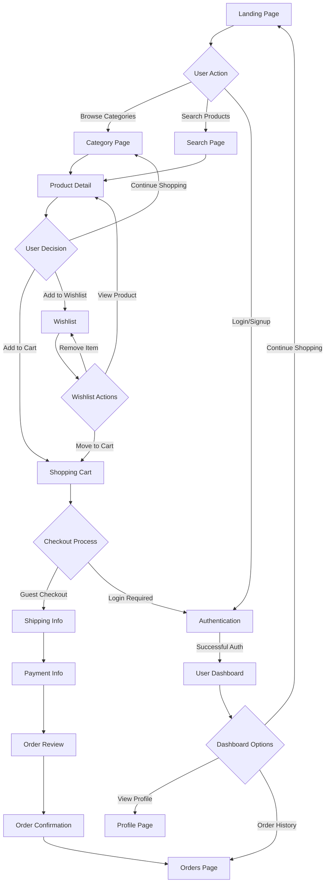

# FashionTrend - Modern E-commerce Web App

 **Aim**  
 To create a responsive, beautifully designed, and fully functional fashion e-commerce web application inspired by Myntra, using React and Tailwind CSS. The app offers a streamlined shopping experience focused on design simplicity, product browsing, smart filtering, and real-time cart functionality — built for the modern shopper.


---
## Live Demo

Hosted Link : https://fashion-trend-ishu.vercel.app/women

##  Project Overview

FashionTrend is a frontend-only fashion commerce web app offering seamless browsing of fashion products across categories like **Men**, **Women**, **Kids**, and **Beauty**.  
It features a clean user interface, advanced filtering, search capabilities, and cart/wishlist features with persistent state using **LocalStorage**.


---

## Features 

###  Core Functionalities
- **Product Catalog**: 70+ products across 4 categories (Women, Men, Kids, Beauty)
- **Advanced Filtering**: Price range, brand, size
- **Smart Search**: Real-time product search with suggestions
- **Shopping Cart**: Add/remove items, quantity management
- **Wishlist**: Save favorite products for later
- **User Authentication**: Login/signup with form validation
- **Order Management**: Complete checkout process with order tracking
- **Responsive Routing**: Built with React Router for page navigation.

---

##  Tech Stack

| Technology     | Purpose                                     |
|----------------|---------------------------------------------|
| **React 18**    | Frontend framework for SPA                 |
| **Vite**        | Fast development and production bundling   |
| **Tailwind CSS**| Utility-first CSS styling                  |
| **React Router**| Client-side routing                        |
| **Lucide Icons**| Clean modern icon system                   |
| **Context API** | Global state (cart, wishlist, auth)        |
| **LocalStorage**| Persistence across reloads                 |

---

##  Folder Structure
```
myntra-ecommerce/
├── public/
│   ├── assets/                
│   └── index.html
├── src/
│   ├── components/                      
│   │   ├── Header.jsx                  
│   │   ├── Footer.jsx                   
│   │   ├── ProductCard.jsx              
│   │   └── FilterSidebar.jsx            # Product filtering
│   ├── pages/                           # Route components
│   │   ├── Home.jsx                     # Landing page
│   │   ├── CategoryPage.jsx             # Product listings
│   │   ├── ProductDetail.jsx            # Individual product view
│   │   ├── Cart.jsx                     # Shopping cart
│   │   ├── Wishlist.jsx                 # Saved products
│   │   ├── Checkout.jsx                 # Order completion
│   │   ├── Login.jsx                    # User authentication
│   │   ├── Signup.jsx                   # User registration
│   │   ├── Profile.jsx                  # User account
│   │   ├── Orders.jsx                   # Order history
│   │   ├── Search.jsx                   # Search results
│   │   └── Contact.jsx                  # Contact form
│   ├── context/
│   │   └── AppContext.jsx               
│   ├── data/
│   │   └── products.js                  
│   ├── App.jsx                          
│   ├── main.tsx                         
│   └── index.css                        
├── package.json
├── tailwind.config.js
├── vite.config.ts
```
##  Application Flow

### User Journey Flowchart



## Future Scope
- **Backend integration using Firebase or Node.js**
- **Payment gateway (Stripe/Razorpay)**
- **Real authentication + order history**
- **Admin dashboard for managing inventory**

##  Deployment

### Build Process
1. Run `npm run build`
2. Test with `npm run preview`
3. Deploy `dist/` folder to hosting service

##  License

This project is ©2025 Ishu. All rights reserved.

##  Acknowledgments

- **Design Inspiration**: Myntra's modern e-commerce interface
- **Icons**: Lucide React icon library
- **Styling**: Tailwind CSS framework
- **Build Tool**: Vite for fast development

---

*This is a demonstration project showcasing modern React development practices and beautiful UI design.*
