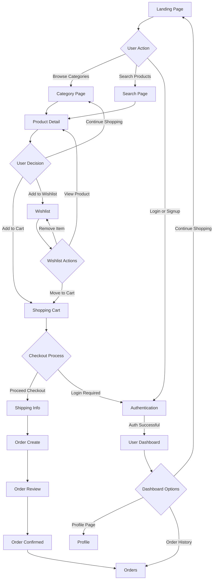

# FashionTrend - Modern E-commerce Web App
A complete full-stack fashion e-commerce application — built using React 18 + Vite, Node.js + Express, MongoDB, JWT Authentication, bcrypt, and Tailwind CSS.
FashionTrend delivers a clean, modern shopping experience with smart filtering, real-time search, cart/wishlist management, authentication, order processing, and a fully functional production-ready backend system following clean MVC architecture.
##  Project Overview
- FashionTrend is a full-stack fashion e-commerce platform designed for the modern shopper.
- Users can browse products across Men, Women, Kids, and Beauty categories with:
- Real-time search
- Advanced client + server-side filtering
- Cart & Wishlist sync with backend
- Authentication (Signup/Login) with JWT
- Order creation & tracking
- Profile and Order History pages
- Scalable API structure with MongoDB
- The backend includes:
- REST API
- JWT authentication
- Secure password hashing
- MongoDB models for Users, Products, Cart, Wishlist, Orders
- Controllers, Routes, Middleware
- CORS + JSON parsing


---
## Live Demo

Hosted Link : https://fashion-trend-ishu.vercel.app/


---

## Features 

###  Core Functionalities
## Product Catalog : 
Fetches products from MongoDB through REST API

## Advanced Filtering : 
Server-side + client-side filtering (brand, price, size)

## Smart Search :
Real-time search through API

## Shopping Cart :
Add/remove/update items (stored in DB per user)

## Wishlist :
Save/remove products (MongoDB-controlled)

## Authentication (JWT) : 
Signup, Login, Profile fetch

## Order Management :
Checkout → Order creation → Clear cart → Order history page

## Protected Routes :
Uses JWT in HTTP headers

## Responsive UI :
Built with Tailwind CSS

## Global State :
Context API for cart, wishlist, auth

---

##  Tech Stack

| **Technology**   | **Purpose**                                    |
| ---------------- | ---------------------------------------------- |
| **React 18**     | Frontend UI framework                          |
| **Vite**         | Frontend bundler (development + production)    |
| **Tailwind CSS** | Utility-first styling                          |
| **React Router** | Single Page Application routing                |
| **Context API**  | Global state management (auth, cart, wishlist) |
| **Node.js**      | Backend runtime environment                    |
| **Express.js**   | Backend web server framework                   |
| **MongoDB**      | NoSQL Database                                 |
| **Mongoose**     | MongoDB object modeling (schemas)              |
| **JWT**          | User authentication + authorization            |
| **bcrypt**       | Password hashing & security                    |
| **CORS**         | Secure frontend-backend communication          |
               


##  Folder Structure
```
FashionTrend/
│
├── frontend/                      # React 18 + Vite + Tailwind CSS
│   ├── public/
│   │   ├── assets/
│   │   └── index.html
│   │
│   ├── src/
│   │   ├── components/
│   │   │   ├── Header.jsx
│   │   │   ├── Footer.jsx
│   │   │   ├── ProductCard.jsx
│   │   │   └── FilterSidebar.jsx      # Handles product filtering
│   │   │
│   │   ├── pages/                     # Route-based pages
│   │   │   ├── Home.jsx               # Landing page
│   │   │   ├── CategoryPage.jsx       # Category-wise products
│   │   │   ├── ProductDetail.jsx      # Product details page
│   │   │   ├── Cart.jsx               # User shopping cart
│   │   │   ├── Wishlist.jsx           # Saved products
│   │   │   ├── Checkout.jsx           # Handling checkout flow
│   │   │   ├── Login.jsx              # User login
│   │   │   ├── Signup.jsx             # User registration
│   │   │   ├── Profile.jsx            # User profile (Protected)
│   │   │   ├── Orders.jsx             # Order history (Protected)
│   │   │   ├── Search.jsx             # Search results page
│   │   │   └── Contact.jsx            # Contact page
│   │   │
│   │   ├── context/
│   │   │   └── AppContext.jsx         # Global state (cart, auth, wishlist)
│   │   │
│   │   ├── data/
│   │   │   └── products.js            # Optional (used before backend)
│   │   │
│   │   ├── App.jsx
│   │   ├── main.jsx
│   │   └── index.css
│   │
│   ├── package.json
│   ├── tailwind.config.js
│   └── vite.config.js
│
│
└── backend/                       # Node.js + Express + MongoDB (MERN API)
    ├── server.js                  # Entry point for server
    ├── package.json
    ├── .env.example               # Env variables
    │
    ├── config/
    │   └── db.js                  # MongoDB connection
    │
    ├── models/                    # Mongoose data models
    │   ├── User.js
    │   ├── Product.js
    │   ├── Cart.js
    │   ├── Wishlist.js
    │   └── Order.js
    │
    ├── controllers/               # API Controllers (CRUD logic)
    │   ├── authController.js
    │   ├── productController.js
    │   ├── cartController.js
    │   ├── wishlistController.js
    │   └── orderController.js
    │
    ├── routes/                    # Route definitions
    │   ├── auth.js                # /api/auth
    │   ├── products.js            # /api/products
    │   ├── cart.js                # /api/cart
    │   ├── wishlist.js            # /api/wishlist
    │   └── orders.js              # /api/orders
    │
    └── middleware/
        └── authMiddleware.js      # JWT token verification

```

---
##  Application Flow

### User Journey Flowchart



## Running the Project (Full Stack)
1️⃣ Install Dependencies (Both Sides)
## Frontend:
- cd frontend
- npm install
- npm run dev

## Backend:
- cd backend
- npm install
- npm run dev

## Future Scope
- Payment gateway (Stripe/Razorpay)
- Admin dashboard for managing products & orders
- Cloud image upload (Cloudinary)
- Reviews & Ratings
- Recommended products using ML
- Email/OTP authentication

##  Deployment

### Build Process
1. Run `npm run build`
2. Test with `npm run preview`
3. Deploy `dist/` folder to hosting service

##  License

This project is ©2025 Ishu. All rights reserved.

##  Acknowledgments

- **Design Inspiration**: Myntra's modern e-commerce interface
- **Icons**: Lucide React icon library
- **Styling**: Tailwind CSS framework
- MERN Stack Architecture Principles

---

*This is a demonstration project showcasing modern full stack development practices and beautiful UI design.*


